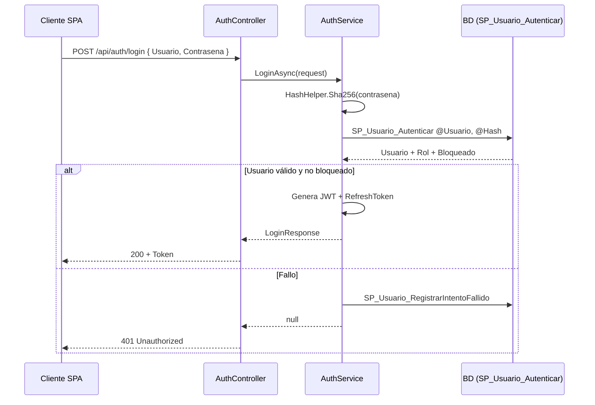

# Plan de Acción - Desarrollo de la API REST (`LexControlApi`)

Guía operativa para implementar el API REST de LexControl conectado a la base de datos `DBLexControl` (SQL Server). El API sigue una arquitectura por capas: Presentación (Controllers) → Aplicación (Services/DTOs) → Datos (Repositorio/DA).

> **Nota**: Los comentarios y documentación deben estar en español, consistente con el repositorio.

---

## 1. Principios Fundamentales

1. **Todo acceso a la BD es por procedimientos almacenados.** Nunca consultas SQL inline. Los SPs son el muro contra inyección SQL (ver AGENTS.md sección 6).
2. **Los DTOs son el contrato público del API.** Nunca exponer entidades del ORM directamente.
3. **Formato de fecha ISO 8601**: `yyyy-MM-dd` para fechas, `yyyy-MM-ddTHH:mm:ss.fffZ` para datetimes.
4. **Borrado lógico siempre**: `Activo = 0`, nunca `DELETE` físico (excepto SP_Expediente_Eliminar con cascade).
5. **Respuestas consistentes**: `{ data, success, error }` o estructura similar.
6. **Autenticación JWT** con SHA256 legacy para compatibilidad con el seed.

## 2. Estructura de Rutas

```
/api/
├── auth/
│   ├── POST   login         → AuthController.Login()
│   └── POST   refresh       → AuthController.Refresh()
├── catalogos            → CatálogosController.GetAll()
├── clientes             → ClientesController (GET/POST/PUT/DELETE)
├── expedientes          → ExpedientesController (CRUD completo)
│   ├── GET /notas
│   ├── POST /notas
│   ├── GET /documentos
│   ├── POST /documentos
│   └── GET /partes
├── audiencias           → AudienciasController
├── tramites             → TramitesController
├── notificaciones       → NotificacionesController
├── eventos              → EventosController (agenda)
├── reportes             → ReportesController
└── configuracion        → ConfiguracionController (perfil, bufete)
```

## 3. DTOs Principales

### 3.1 Auth

```csharp
// DTOs/Auth/LoginRequest.cs
public class LoginRequest
{
    [Required] public string Usuario { get; set; } = string.Empty;
    [Required] public string Contrasena { get; set; } = string.Empty;
}

// DTOs/Auth/LoginResponse.cs
public class LoginResponse
{
    public string Token { get; set; } = string.Empty;
    public string RefreshToken { get; set; } = string.Empty;
    public DateTime Expiracion { get; set; }
    public string Usuario { get; set; } = string.Empty;
    public string NombreCompleto { get; set; } = string.Empty;
    public string Rol { get; set; } = string.Empty;
    public int RolId { get; set; }
}
```

### 3.2 Cliente

```csharp
// DTOs/Clientes/ClienteDto.cs
public class ClienteDto
{
    public int Id { get; set; }
    public string NombreCompleto { get; set; } = string.Empty;
    public string? Dpi { get; set; }
    public string? TelefonoPrincipal { get; set; }
    public string? EmailPrincipal { get; set; }
    public string? TelefonoSecundario { get; set; }
    public string? EmailSecundario { get; set; }
    public string? Direccion { get; set; }
    public DateOnly? FechaNacimiento { get; set; }
    public string? Genero { get; set; }
    public string TipoCliente { get; set; } = "Particular";
    public string? Notas { get; set; }
    public bool Activo { get; set; }
    public int ExpedientesActivos { get; set; }
}

// DTOs/Clientes/ClienteCreateDto.cs
public class ClienteCreateDto
{
    [Required, MaxLength(100)] public string NombreCompleto { get; set; } = string.Empty;
    [StringLength(20)] public string? Dpi { get; set; }
    [StringLength(20)] public string? TelefonoPrincipal { get; set; }
    [StringLength(100), EmailAddress] public string? EmailPrincipal { get; set; }
    [StringLength(20)] public string? TelefonoSecundario { get; set; }
    [StringLength(100), EmailAddress] public string? EmailSecundario { get; set; }
    [StringLength(200)] public string? Direccion { get; set; }
    public DateOnly? FechaNacimiento { get; set; }
    [RegularExpression("^(M|F|O)?$")] public string? Genero { get; set; }
    public string TipoCliente { get; set; } = "Particular";
    [StringLength(500)] public string? Notas { get; set; }
    public int UsuarioCreacionId { get; set; }
}

// DTOs/Clientes/ClienteUpdateDto.cs
public class ClienteUpdateDto : ClienteCreateDto
{
    public bool? Activo { get; set; }
}
```

### 3.3 Expediente

```csharp
// DTOs/Expedientes/ExpedienteDto.cs
public class ExpedienteDto
{
    public int Id { get; set; }
    public string NoExpediente { get; set; } = string.Empty;
    public int ClienteId { get; set; }
    public string ClienteNombre { get; set; } = string.Empty;
    public int RolProcesalId { get; set; }
    public string RolProcesal { get; set; } = string.Empty;
    public int RamaId { get; set; }
    public string Rama { get; set; } = string.Empty;
    public string? TipoProceso { get; set; }
    public int JuzgadoId { get; set; }
    public string JuzgadoNombre { get; set; } = string.Empty;
    public DateOnly FechaIngreso { get; set; }
    public int EstadoId { get; set; }
    public string Estado { get; set; } = string.Empty;
    public string? Descripcion { get; set; }
    public string? NotasInternas { get; set; }
    public DateOnly? FechaCierre { get; set; }
    public int AbogadoId { get; set; }
    public string AbogadoNombre { get; set; } = string.Empty;
}

// DTOs/Expedientes/ExpedienteListaDto.cs (para la tabla maestra)
public class ExpedienteListaDto
{
    public int Id { get; set; }
    public string NoExpediente { get; set; } = string.Empty;
    public string Cliente { get; set; } = string.Empty;
    public string RolProcesal { get; set; } = string.Empty;
    public string Rama { get; set; } = string.Empty;
    public string Estado { get; set; } = string.Empty;
    public string EstadoColor { get; set; } = string.Empty;
    public DateOnly FechaIngreso { get; set; }
    public string Abogado { get; set; } = string.Empty;
}
```

### 3.4 Reportes

```csharp
// DTOs/Reportes/ReporteRespuestaDto.cs
public class ReporteRespuestaDto<TResumen, TDetalle>
{
    public List<TResumen> Resumen { get; set; } = new();
    public List<TDetalle> Detalle { get; set; } = new();
}
```

## 4. Formato de Respuesta de API

### 4.1 Respuesta exitosa (200)
```json
{
  "success": true,
  "data": { ... }
}
```

### 4.2 Respuesta con errores de validación (400)
```json
{
  "success": false,
  "error": "Datos de entrada inválidos.",
  "errores": [ "El DPI debe contener 13 dígitos." ]
}
```

### 4.3 Respuesta de error del servidor (500)
```json
{
  "success": false,
  "error": "Error interno del servidor. Consulte los logs."
}
```

### 4.4 Clase Response genérica (Helpers/ApiResponse.cs)

```csharp
public class ApiResponse<T>
{
    public bool Success { get; set; }
    public T? Data { get; set; }
    public string? Error { get; set; }
    public List<string>? Errores { get; set; }
}
```

## 5. Acceso a Datos (Capa Data)

### 5.1 ConnectionFactory (`Data/ConnectionFactory.cs`)
```csharp
public interface IConnectionFactory
{
    SqlConnection CreateConnection();
}

public class SqlConnectionFactory : IConnectionFactory
{
    private readonly string _connectionString;
    public SqlConnectionFactory(IConfiguration config) =>
        _connectionString = config.GetConnectionString("DefaultConnection");
    public SqlConnection CreateConnection() => new(_connectionString);
}
```

### 5.2 Repositorio Genérico (`Data/IRepositorio.cs`)

```csharp
public interface IRepositorio
{
    Task<T?> QuerySingleAsync<T>(string sp, object? parametros = null);
    Task<List<T>> QueryListAsync<T>(string sp, object? parametros = null);
    Task<(List<T1> Resumen, List<T2> Detalle)> QueryMultipleAsync<T1, T2>(
        string sp, object? parametros = null);
    Task<int> ExecuteAsync(string sp, object? parametros = null);
    Task<int> InsertarConIdentityAsync<T>(string sp, T modelo) where T : class;
}
```

### 5.3 Implementación con Dapper (`Data/RepositorioSql.cs`)

- Usa `Dapper` para mapeo automático de columnas a propiedades (resolución implícita CamelCase ↔ [Column]).
- Método `InsertarConIdentityAsync`: ejecuta el SP, recupera `@NuevoID OUTPUT`, lanza excepción si devuelve -1.
- Método `QueryMultipleAsync`: ejecuta SP que devuelve 2 result sets (resumen + detalle), usa `QueryMultiple` de Dapper.

### 5.4 Manejo de resultados de SPs con `RETURN`

- Los SPs devuelven 0 (éxito) o `ERROR_NUMBER()` (fallo).
- El repositorio revisa `returnParam` (marcado con `IsNullable = true, Size = -1`) y lanza `DbException` si ≠ 0.

## 6. Autenticación (`Services/AuthService.cs`)

### Flujo de login



### Claims del JWT
| Claim | Fuente |
|---|---|
| `sub` | `Usuario_ID` |
| `unique_name` | `Usuario` |
| `name` | `NombreCompleto` |
| `role` | `RolNombre` |
| `role_id` | `Rol_ID` (como string) |

### Helper de hash (`Helpers/HashHelper.cs`)
```csharp
public static string Sha256Hash(string input)
{
    using var sha = SHA256.Create();
    var bytes = Encoding.UTF8.GetBytes(input);
    var hash = sha.ComputeHash(bytes);
    return Convert.ToBase64String(hash);  // <-- Coincide con seed SQL (SHA256)
}
```

> **Importante**: El seed en `Base_Datos.sql` usa `CONVERT(VARBINARY(255), HASHBYTES('SHA2_256', 'admin123'))` y luego cast a NVARCHAR. El hash en C# debe producir el mismo string hex/base64. Verificar contra el seed: hash de `admin123` = `240be518fabd2724ddb6f04eeb1da5967448d7e831c08c8fa822809f74c720a9`.

## 7. Checklist de Implementación por Controlador

### AuthController
- [ ] `POST /api/auth/login` — valida credenciales, SHA256, JWT
- [ ] `[HttpPost]` con `[AllowAnonymous]`
- [ ] Registrar intento fallido en fallo
- [ ] Swagger: documenta con `[ProducesResponseType]`

### CatalogosController
- [ ] `GET /api/catalogos` — lista todos los catálogos + abogados
- [ ] Cachear en memory cache (cambian raramente)

### ClientesController
- [ ] `GET /api/clientes` — `SP_Cliente_Buscar` con filtros query
- [ ] `GET /api/clientes/{id:int}` — `SP_Cliente_ObtenerPorID`
- [ ] `POST /api/clientes` — `SP_Cliente_Insertar` (transacción Persona + Cliente)
- [ ] `PUT /api/clientes/{id:int}` — crear `SP_Cliente_Actualizar` (falta en BD)
- [ ] `DELETE /api/clientes/{id:int}` — borrado lógico (`Update Cliente SET Activo=0`)
- [ ] Validación con FluentValidation (`ClienteCreateDtoValidator`)

### ExpedientesController
- [ ] `GET /api/expedientes` — `SP_Expediente_Listar`
- [ ] `GET /api/expedientes/{id:int}` — `SP_Expediente_ObtenerPorID`
- [ ] `POST /api/expedientes` — `SP_Expediente_Insertar`
- [ ] `PUT /api/expedientes/{id:int}` — `SP_Expediente_Actualizar`
- [ ] `PUT /api/expedientes/{id:int}/estado` — `SP_Expediente_CambiarEstado`
- [ ] `DELETE /api/expedientes/{id:int}` — `SP_Expediente_Eliminar`
- [ ] Sub-recursos: notas, documentos, partes

### AudienciasController
- [ ] `GET /api/audiencias` — listar con filtros
- [ ] `GET /api/audiencias/proximas` — `SP_Audiencia_Proximas`
- [ ] `POST /api/audiencias` — `SP_Audiencia_Insertar`
- [ ] `PUT /api/audiencias/{id:int}/resultado` — `SP_Audiencia_RegistrarResultado`
- [ ] Necesita `SP_Audiencia_Listar` y `SP_Audiencia_ObtenerPorID` (no existen → crear)

### TramitesController
- [ ] `GET /api/tramites` — listar con filtros
- [ ] `POST /api/tramites` — `SP_Tramite_Insertar`
- [ ] `PUT /api/tramites/{id:int}/estado` — `SP_Tramite_ActualizarEstado`
- [ ] Necesita SPs de listar y obtener (crear)

### NotificacionesController
- [ ] `GET /api/notificaciones` — listar con filtros
- [ ] `POST /api/notificaciones` — `SP_NotificacionOJ_Insertar`
- [ ] `PUT /api/notificaciones/{id:int}/atender` — `SP_NotificacionOJ_Atender`
- [ ] `POST /api/notificaciones/verificar-duplicado` — `SP_NotificacionOJ_VerificarDuplicado`
- [ ] Necesita SPs de listar y obtener (crear)

### EventosController (Agenda)
- [ ] `GET /api/eventos/dia` — `SP_Evento_ObtenerDelDia` (params: Usuario_ID, Fecha)
- [ ] `POST /api/eventos` — `SP_EventoBase_Insertar`
- [ ] `POST /api/eventos/audiencia` — `SP_EventoAudiencia_Insertar`

### ReportesController
- [ ] 11 endpoints GET mapeados a `SP_Reporte_*`
- [ ] Cada uno retorna `{ Resumen, Detalle }`
- [ ] Usar `QueryMultipleAsync<T1, T2>`

### ConfiguracionController
- [ ] `GET /api/configuracion` — claves del bufete
- [ ] `GET /api/configuracion/perfil` — perfil del usuario autenticado
- [ ] `PUT /api/configuracion/perfil` — actualizar PERSONA
- [ ] `PUT /api/configuracion/cambiocontrasena` — cambiar hash en USUARIO

## 8. Middleware y Configuración (Program.cs)

```csharp
var builder = WebApplication.CreateBuilder(args);

// --- Servicios ---
builder.Services.AddControllers();
builder.Services.AddOpenApi();
builder.Services.AddEndpointsApiExplorer();

// CORS
builder.Services.AddCors(options =>
{
    options.AddPolicy("LexControlCors", policy =>
        policy.WithOrigins("http://localhost:5181", "https://localhost:7200", "http://localhost:3000")
              .AllowAnyHeader()
              .AllowAnyMethod()
              .AllowCredentials());
});

// Autenticación JWT
var jwtSettings = builder.Configuration.GetSection("Jwt");
var secretKey = jwtSettings["Secret"] ?? Environment.GetEnvironmentVariable("JWT_SECRET");
var key = new SymmetricSecurityKey(Encoding.UTF8.GetBytes(secretKey!));
builder.Services.AddAuthentication(JwtBearerDefaults.AuthenticationScheme)
    .AddJwtBearer(options =>
    {
        options.TokenValidationParameters = new TokenValidationParameters
        {
            ValidateIssuer = true,
            ValidateAudience = true,
            ValidateLifetime = true,
            ValidateIssuerSigningKey = true,
            ValidIssuer = jwtSettings["Issuer"],
            ValidAudience = jwtSettings["Audience"],
            IssuerSigningKey = key
        };
    });
builder.Services.AddAuthorization();

// DI
builder.Services.AddSingleton<IConnectionFactory, SqlConnectionFactory>();
builder.Services.AddScoped<IRepositorio, RepositorioSql>();
builder.Services.AddScoped<IAuthService, AuthService>();
builder.Services.AddScoped<ICatalogoService, CatalogoService>();
builder.Services.AddScoped<IReporteService, ReporteService>();
builder.Services.AddMemoryCache();

// FluentValidation
builder.Services.AddValidatorsFromAssemblyContaining<Program>();

var app = builder.Build();

// --- Pipeline ---
if (app.Environment.IsDevelopment()) app.MapOpenApi();

app.UseMiddleware<ManejadorExcepciones>();   // antes de CORS
app.UseCors("LexControlCors");
app.UseAuthentication();
app.UseAuthorization();
app.MapControllers();
app.Run();
```

## 9. SPs que Faltan por Crear

Estos stored procedures no existen aún y son necesarios para completar el CRUD:

| SP propuesto | Tabla | Operación | Notas |
|---|---|---|---|
| `SP_Cliente_Actualizar` | CLIENTE + PERSONA | UPDATE | Actualiza ambas tablas con transacción |
| `SP_Cliente_Desactivar` | CLIENTE | UPDATE Activo=0 | Borrado lógico con cascade a PERSONA |
| `SP_Audiencia_Listar` | AUDIENCIA | SELECT | Con filtros (Expediente_ID, Fecha, Estado, Tipo) |
| `SP_Audiencia_ObtenerPorID` | AUDIENCIA | SELECT | Con joins |
| `SP_Tramite_Listar` | TRAMITE | SELECT | Con filtros |
| `SP_Tramite_ObtenerPorID` | TRAMITE | SELECT | Con joins |
| `SP_Notificacion_Listar` | NOTIFICACION_OJ | SELECT | Con filtros |
| `SP_Diligencia_Listar` | DILIGENCIA | SELECT | Con filtros |
| `SP_Diligencia_Insertar` | DILIGENCIA | INSERT | (no existe aún) |
| `SP_Permiso_ObtenerPorRol` | — | SELECT | Para la matriz de permisos del mock `permisos-comun.js` |
| `SP_Configuracion_ObtenerTodas` | CONFIGURACION | SELECT | Lista todas las claves |
| `SP_Configuracion_Actualizar` | CONFIGURACION | UPDATE | Upsert de clave/valor |
| `SP_Persona_Actualizar` | PERSONA | UPDATE | Para perfil de usuario |
| `SP_Usuario_CambiarContrasena` | USUARIO | UPDATE | Cambio de hash (SHA256 legacy) |

> Todos los nuevos SPs deben seguir las convenciones de AGENTS.md: `CREATE OR ALTER`, `SET NOCOUNT ON`, `BEGIN TRY/CATCH`, parámetros `@CamelCase`, `RETURN 0`/`ERROR_NUMBER()`.

## 10. Matriz de Permisos (basada en `permisos-comun.js`)

Extraída del frontend mock. El backend debe exponer:

```
Rol          Módulos permitidos
────────────────────────────────────────────────────────
Administrador  → todo (dashboard, clientes, expedientes, agenda, tramites, historico, notificaciones, mantenimiento, reportes, ajustes)
Secretaria     → dashboard, agenda, notificaciones, ajustes
Abogado        → dashboard, clientes, expedientes, agenda, tramites, notificaciones, ajustes
```

- `GET /api/permisos` — devuelve la matriz por Rol.
- Implementar como tabla `PERMISO` o derivar dinámicamente del Rol.

## 11. Estrategia de Testing

1. **Swagger UI** (`https://localhost:5181/scalar/v1` o `/swagger`) para pruebas manuales.
2. **Archivo `LexControlApi.http`** — añadir requests para cada endpoint (login, clientes, expedientes, reportes).
3. **Validar contra BDs de prueba**:
   - Ejecutar `Base_Datos.sql` → `Proceso_almacenados.sql` → `Reportes_almacenados.sql` en una instancia SQL Server local (Docker recomendado).
   - Credenciales admin/admin123.
4. **Verificar contrato JSON**: las respuestas deben mapear a los DTOs que el frontend mock espera.

## 12. Comandos de Desarrollo

```bash
# Desde la carpeta del proyecto
dotnet run                          # ejecuta la API en http://localhost:5181 / https://localhost:7200
dotnet build                        # compila
dotnet watch run                    # recarga en caliente
```

### Variables de entorno

| Variable | Uso |
|---|---|
| `JWT_SECRET` | Override del secret del appsettings.json (producción) |
| `SQL_SERVER_CONN` | Override del connection string (producción) |
